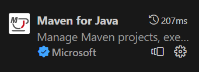
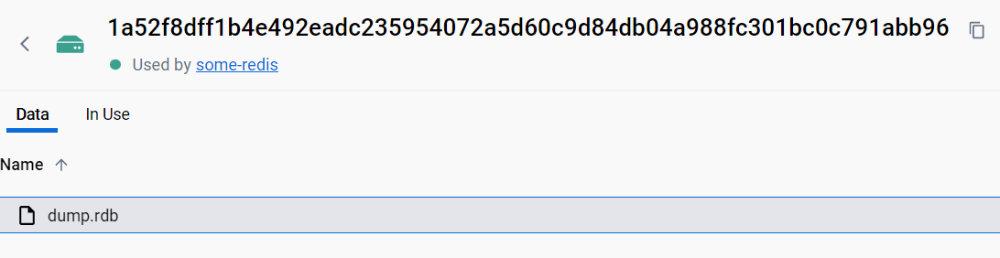
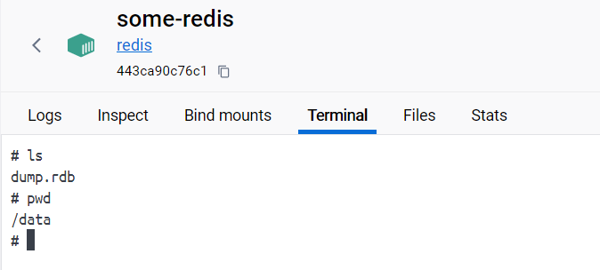

# Scrapping Proiektua

Scrapping proiektua 

Proiektu honen helburua software-sistema bat garatzeko urratsekin familiarizatzea da. Beraz, foku nagusia osagaien instalazioan, konfigurazioan eta konexioan ezarriko da, scrapping aplikazio baten garapenean baino. bigarrena Erabilera komuneko kasu batetik abiatutako testuinguru bat eskaintzeagaitik da, eta gainera, etorkizunean proiektu gehiagotarako balio daiteke.

- [Scrapping Proiektua](#scrapping-proiektua)
- [Analisi fasea](#analisi-fasea)
- [Garapena](#garapena)
  - [Githuben repositorioa sortu](#githuben-repositorioa-sortu)
  - [Garapen ingurunea sortu](#garapen-ingurunea-sortu)
  - [Java Boilerplate proiektua sortu](#java-boilerplate-proiektua-sortu)
  - [Maven erabiltzen](#maven-erabiltzen)
  - [Redis datu basea ezarri](#redis-datu-basea-ezarri)
    - [Contenedorea sortu](#contenedorea-sortu)
    - [Volumena aztertzen](#volumena-aztertzen)
  - [Java eta redis konektatu](#java-eta-redis-konektatu)
    - [Redis datu basearen helbidea](#redis-datu-basearen-helbidea)
  - [Scrapinerako java libreria](#scrapinerako-java-libreria)
  - [Oinarrizko funtzionaltasun bat implementatzen](#oinarrizko-funtzionaltasun-bat-implementatzen)
    - [Helbideak gordetzeko objetua sortu](#helbideak-gordetzeko-objetua-sortu)
    - [Serbitzua sortu](#serbitzua-sortu)
  - [Web serbitzu bat sortu](#web-serbitzu-bat-sortu)
  - [Web orrialde bat sortu](#web-orrialde-bat-sortu)
  - [Proiektua txukuntzen](#proiektua-txukuntzen)


# Analisi fasea
- Klasean adostu da, momentuz denek proiektu bera sortuko dugula irakaslearen gidaz, zailtasuna dela kontuan izanda lan fluxu hau erabiliz sortzen den lehenengo proiektua dela.
- Adostu da java erabiltzea programazioan lantzen den legoaia delak gehien bat, Scrappinerako python egokiagoa izan arren.
- Adostu da java spring-boot erabiltzea proiektu txikiak sortzeko eskeintzen dituen errestasunengaitik.
- Datu base bezala, redis erabiliko bere errazatasunagaitik.
- Docker erabiliko da garapen kontainerizazio plataforma gisa ikasle gustiak istalatuta daukatelako eta portatiletan abiadura handiz maquinan eta aplikazioak sortzen ahalbidetzen duelako, beste batzuen arten.
- Visual estudia erabiliko da dockerrekin integratzen delako eta gaur egun IDE oso ezaguna eta erabilia delako.

# Garapena

## Githuben repositorioa sortu
Sortu repositorio huts bat scrappingProiektua izenarekin githuben

## Garapen ingurunea sortu
Docker eta Visual studio instalatuta izan behar dituzu.

1. Instalatu hurrengo extensioa


2. Klikatu izkinako botoi urdinean Visual Studioren testuingura aldatzeko, hau da lokaletik makina batera aldatzeko, eta hautatu **New dev container** aukera.


3. Idatzi java eta hautatu irudikoa


Pauso hauek jarraituta garapenerako kontendore bat sortu egingo da java, github eta beste tresna batzuekin. 

4. Klonatu gure github repositorioa sortutako makinak

## Java Boilerplate proiektua sortu

1. Honetarako spring eskeintzen duen [proiektu sortzailea erabiliko dugu.](https://start.spring.io/)

Ezarri huerrengo parametroak erabili eta deskargatu proiektua.


2. Proiektuaren edukia kontenedoreko gure repositorioaren erroan itsatziko dugu.

3. Proiektuarekin datorren java main fitzategia exekutatzen saiatuko gara,

4. Igo aldaketak gitHubera hurrengo komandoak erabiliz.
   
   ```git add --all```
   
   ```git commit -m "lehen commita"```
   
   ```git push```


ikertu [Spring Boot](https://spring.io/projects/spring-boot)

## Maven erabiltzen

Maven dependentzia kudeaketarako programa bat da, javan erabiltzen dena, gure proiektuak maven erabiliko du eta honek hainbat comando eta erabilera ditu. Gure erabilera kasuak oso murriztuak izango dira beraz horiek ikusiko digutu soilik.

1. Maven instalatu: Izan daiteke maven instalatuta ez izatea. Gure proiektuan, **mvnw** eta **mvnw.cmd**(windowserako) izeneko script batzuk daude. Hauek, maven komandoak erabiltzen lagunduko digu, baita gure proiektuak erabiltzen duen bertsioa aurkituko du eta behar dugun mavena deskargatuko du.

    - ```./mvnw spring-boot:run```

2. Maven extensioa ezarri Visual Studion



3. Erabili ```Ctr + Shift + P``` eta bilatu eta aukeratu **maven execute command** , maven **clean**, **install** edo **test** erabiltzeko. **custom** aukeratzekotan `clean spring-boot:run`

[Zer da maven](https://maven.apache.org/)
[Pom referentzia](https://maven.apache.org/pom.html)

## Redis datu basea ezarri

### Contenedorea sortu
1. Sortu dockerren redis datu base bat huerrengo komandoa erabilita

```docker run --name some-redis -d redis redis-server --save 60 1 --loglevel warning```

Informazio gehiago parametroei buruz, [Nola sortu dockerren](https://hub.docker.com/_/redis)

### Volumena aztertzen

Antzemango duzunez, volumen berri bat sortu da.


Volumen honek **dump.rdb** fitxategi bat besterik ez du izango. Hau, datu basearen kopia bat da eta 60 segundoro eguneratuko da **gutxienez aldaketa 1 izan bada**, goiko komandoan horrela ezarri baidugu. Fitxategi hau garrantzitsua da datu basea berreskuratu edo gorde nahi izatekotan.



Gure kasuan volumena kontenedoreko **/data** helbidean izango da montatuta, terminalaren bitartez ikusi dezakegu hau:



Hurrengo pausoan, gure java proiektutik redis datu basera konektatzen saiatuko gara

## Java eta redis konektatu

Hurrengo [gida erabiliko dugu](https://redis.io/docs/clients/java/). 

1. Aipatzen den dependentzia ```pom.xml``` fitxategira gehitu
2. Erakusten den kodea ScrappingApplicationTest.java klasean sartu, funtzio berri bat sortuz eta @Tets etiketa erabiliz.
3. Saiatu maven test executatzen goiko atalan azaldu den moduan. Zer gertatzen da?
4. Datu basearen helbide parametroak zuzendu behar ditugu, hurrengo puntuan.

### Redis datu basearen helbidea

Dockerren kontenedoreak sare virtualen bitartez konektatzen dira, hainbat sare mota daude dockerren eta hurrengo hiruilekoeta sakonago ikusiko ditugu, [dockerren sare motak YouTuben](https://youtu.be/bKFMS5C4CG0?si=2JvJv5apL_O3o6f5).

Momentuz, jakin dezagun, sarerik zehaztu ez dugunez kontenedoreak sortzerakoan, hauek, **bridge** edo defektuzko sarera gehitu dira:

1. Erabili ```docker network``` agindua ikusteko zer aukera ditugun sareak kudeatzeko.
2. Erabili ```docker network ls``` existitzen diren sareak zerrendatzeko.
3. Erabili azkenik ```docker network inspect bridge``` bridge sarean konektaturiko gailuak ikusteko.
4. Honekin ezagutu dezakegu zein ipv4 helbide erabili beharko dugun javan.
5. Aldatu helbidea javako kodean eta errepikatu testa, orain zuzena izan beharko litzateke.

## Scrapinerako java libreria


Jsoup erabiltzeko [gida hau](https://www.baeldung.com/java-with-jsoup) erabiliko dugu.

1. Maven dependentzia gehitu
2. Test metodo berri bat sortu eta kode txiki bat erabili ziurtatzeko libreria funtzionatzen duela.

## Oinarrizko funtzionaltasun bat implementatzen

Lehenego piezak konfiguratu eta martxan jarri ditugula, implementazio txiki bat egingo dugu. 

**Implementazioaren helburua, helbide bat arakatzea eta webguneko link guztiak gordetzea da.**

### Helbideak gordetzeko objetua sortu
Helbidea izeneko objetu bat sortu **Helbidea** izenarik, bi zelairekin eta metodo batekin

- `String html`
- `String href`

- `public HashMap<String,String> hashMap()`: Itzuli hash map bat objetoaren bi zelaiekin, ikusi testetan dagoen adibidea.

  
### Serbitzua sortu

Sortu zerbitzu klase bat hurrengo funtzioekin:
[Nola sortu serbitzu bat](https://www.geeksforgeeks.org/spring-service-annotation-with-example/)

`public List<Helbidea> scrap(Helbidea helbidea)`
- **scrap**:
Helbide bat emonda, itzuli web helbide horretan dauden helbide zerrenda, sortu test bat egiaztatzeko

`public void save(List<Helbidea> helbideak)`

- **save**: Helbide zerrenda bat emonda, gorde redisen helbide guztiak, sortu test bat helbideen gordeketa ziurtatzeko eta gero ezabatu redisetik testean sortutako datuak

`public List<Helbidea> scrapAndSave(Helbidea helbidea)`

- **scrapAndSave**: Helbide bat emonda, arakatu web horreko helbideak, gorde redisen eta itzuli helbide zerrenda. Sortu test bat emaitza egiaztatzeko.


## Web serbitzu bat sortu

[Erabili dezakegun gida](https://spring.io/guides/gs/rest-service/)

1. Springek web serbitzu bat nola sortzen den ikertu
2. Sortu zerbitzu bat, web helbide bat emonda, json bat itzultzen duena, link listarekin
3. Frogatu serbitzua funtzionatzen duen postman edo bestelako HTTP kliente batekin. Izan daiteke dockerren porturen bat zabaldu beharra.


## Web orrialde bat sortu

1. Sortu web orrialde simple bat, funtzio bakarra izango duena, textu zelai bat izango du erdian eta search botoi bat.
2. Botoia klikatzerakoan, sortu dugun web serbitzura deituko du eta zelaiko edukia bidaliko du. Eduki hau webgune baten helbidea bada, lista batekin erantzungo digu, erakutsi lista hau web horrialdean.

## Proiektua txukuntzen

Ordurarte zenbait pieza sortu ditugu, frogatu eta batera lanean martxan jarri ditugula hurrengo pausoak proiekturen despliegea erraztea izango da. Hau da, norbaiti proiektuaren repositoria entregatuz, era erraz batean dena martxan jartzeko gai izan behar da.

1. Konfiguraketa parametroak, adibidez redisen helbidea
2. [Java spring boot servitzariaren contendorea](https://anywhere.epam.com/en/blog/how-to-dockerize-spring-boot-application)
3. web orrialdearen kontenedorea nola sortu
4. kontendore guztia, web orrialdea, java back-end a eta redis datu basea batera desplegatu docker compose erabiliz (IRAKASLEAK EGINGO DU HAU)
5. [Docker on Docker](https://blog.packagecloud.io/3-methods-to-run-docker-in-docker-containers/#:~:text=Docker%20In%20Docker%20(also%20known,and%20create%20sandboxed%20container%20environments.)